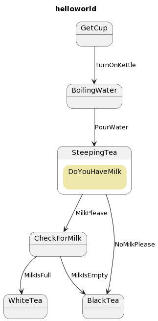

# State4k

<a href="https://mvnrepository.com/artifact/dev.forkhandles"></a>
[](https://github.com/fork-handles/forkhandles/actions/workflows/build.yaml)

<a href="http//www.apache.org/licenses/LICENSE-2.0"></a>
<a href="https://codebeat.co/projects/github-com-fork-handles-forkhandles-trunk"></a>

Simple state machine modelling. Define the state-machine in terms of states, events and commands

## Installation

In Gradle, install the ForkHandles BOM and then this module in the dependency block:

```kotlin
implementation(platform("dev.forkhandles:forkhandles-bom:X.Y.Z"))
implementation("dev.forkhandles:state4k")
```

## How to use

State4k introduces a mechanic for moving a state machine from state to state using events in a strict fashion. To define a state machine, you need:

1. An `Entity` which is the object being modelled
2. A set of `States`, which the entity can be in
3. A set of `Events` to transition between those states. Each transition may result in an optional command being generated as a reaction to the transition. 

The model is built by creating the machine with a set of transitions which tie a starting `State`, an `Event`, a modification process to the `Entity` when that event is received, and an optional `Command` to generate and send upon the transition.

Transitions occur in one of 2 ways:

1. Receive a known out-of-band `Event`. This modifies the state of the entity in a known way, and may generate a `Command` as per the defined transition table.
2. Receive and process a `Command`, which will result in one of a discreet set of `Events` to be applied (see #1)

## Example

We have a state machine which has 4 states. On transition to state 2 we generate a command, the result of which will generate one of 2 events:



The entities look like:
```kotlin

data class SimpleEntity(val state: SimpleState, val lastAction: String)

enum class SimpleState {
    one, two, three, four
}

interface SimpleEvent

data object SimpleEvent1 : SimpleEvent

data object SimpleEvent2 : SimpleEvent
data object SimpleEvent3 : SimpleEvent

enum class SimpleCommandType {
    aCommand
}
```

We can define the state machine in code as:

```kotlin
// the lens gets and sets the state on the Entity
val lens = EntityStateLens(SimpleEntity::state) { entity, state -> entity.copy(state = state) }

// the commands is responsible for issuing new commands to process the machine
val commands = Commands<SimpleEntity, SimpleCommand, String> { _: SimpleEntity, _ -> Success(Unit) }

// define the machine
val simpleStateMachine = StateMachine<SimpleState, SimpleEntity, SimpleEvent, SimpleCommand, String>(
    commands,
    lens,
    // define the state transitions for state one
    StateBuilder<SimpleState, SimpleEntity, SimpleCommand>(one)
        .transition<SimpleEvent1>(two, { e, o -> o.copy(lastAction = "received $e") }, aCommand),

    // define the state transitions for state two
    StateBuilder<SimpleState, SimpleEntity, SimpleCommand>(two)
        .transition<SimpleEvent2>(three, { e, o -> o.copy(lastAction = "received $e") })
        .transition<SimpleEvent3>(four, { e, o -> o.copy(lastAction = "received $e") })
)
```

To manipulate the machine, we can call one of 2 methods - one for async events and one for command processing (which will result in a discreet event being generated). Each transition results in a `Result4k` result determining if the transition was successful

```kotlin
 // returns OK with the updated entity, and the aCommand is issued and sent
    val update1 = simpleStateMachine.transition(
        SimpleEntity(one, ""),
        SimpleEvent1
    )
    // returns "illegal transition" - no transition is made and no commands sent
    val failed = simpleStateMachine.transition(
        SimpleEntity(one, ""),
        SimpleEvent2
    )

    // returns OK with the updated entity in state three or four
    val update2 = simpleStateMachine.transition(SimpleEntity(two, ""), aCommand) {
        // imagine a remote operation here which could go one of 2 ways (or fail!)
        when (Random.nextBoolean()) {
            true -> Success(SimpleEvent2)
            false -> Success(SimpleEvent3)
        }
    }
```
